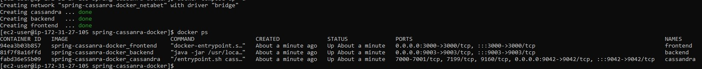

# Deploy Maven and Cassandra with Docker Compose

[![LinkedIn][linkedin-shield]][linkedin-url]
[![Twitter][twitter-shield]][twittwe-url]
[![Twitter][github-shield]][github-url]


<!-- PROJECT LOGO -->
<p align="center">

  <h3 align="center"> Deploying a Maven web application as backend and JavaScript as frontend with Cassandra database </h3>


  
# Steps
### 1. Clone the repo

After install Docker and Docker-Compose on your machine
Clone the `SpringBoot-Cassanra-Docker` locally. In a terminal, run:

```
git clone https://github.com/Ahmad-Faqehi/SpringBoot-Cassanra-Docker.git
cd SpringBoot-Cassanra-Docker/
```
* Will find `cql` file in cassandra directory, replace it  with your cql file if had one.

### 2. Build Docker Compose

```shell
docker-compose up -d --build
docker ps
```
Will find three of containers running 

<p>You can access each one normally from browser</p>

### 3. Remove all containers
<p> You can remove all the containers by one command </p>


```shell
docker-compose down
```


<!-- CONTACT -->
## Contact Me

Ahmad Faqehi - [iAhmad.info](https://iAhmad.info) - alfaqehi775@hotmail.com

Project Link: [https://github.com/Ahmad-Faqehi/SpringBoot-Cassanra-Docker](https://github.com/Ahmad-Faqehi/SpringBoot-Cassanra-Docker)


<!-- MARKDOWN LINKS & IMAGES -->
<!-- https://www.markdownguide.org/basic-syntax/#reference-style-links -->
[linkedin-shield]: https://img.shields.io/badge/-LinkedIn-black.svg?style=for-the-badge&logo=linkedin&colorB=555
[linkedin-url]: https://linkedin.com/in/ahmad-faqehi
[twitter-shield]: https://img.shields.io/badge/-twitter-black.svg?style=for-the-badge&logo=twitter&colorB=555
[twittwe-url]: https://twitter.com/A_F775
[github-shield]: https://img.shields.io/badge/-github-black.svg?style=for-the-badge&logo=github&colorB=555
[github-url]: https://github.com/Ahmad-Faqehi
